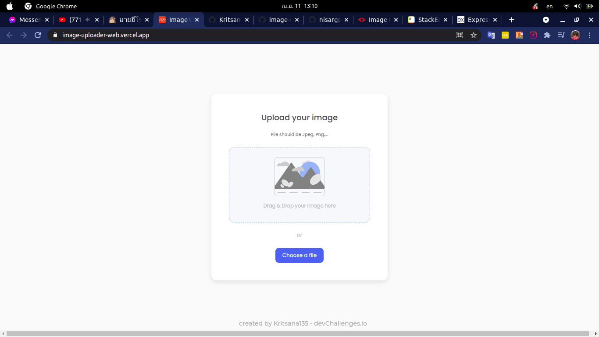
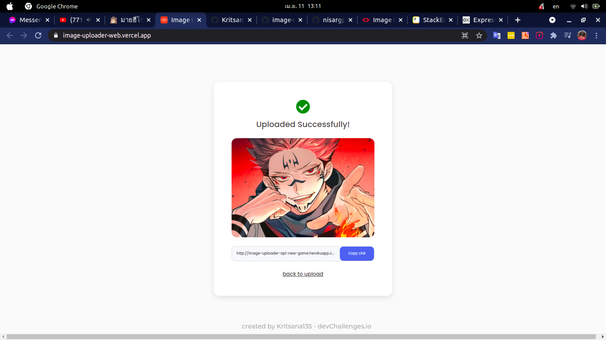

<!-- Please update value in the {}  -->

<h1 align="center">Image Uploader</h1>

<div align="center">
   Solution for a challenge from  <a href="http://devchallenges.io" target="_blank">Devchallenges.io</a>.
</div>

<div align="center">
  <h3>
    <a href="https://devchallenges.io/challenges/O2iGT9yBd6xZBrOcVirx">
      Challenge
    </a>
  </h3>
</div>


<!-- OVERVIEW -->

## Screenshots





### Built With

<!-- This section should list any major frameworks that you built your project using. Here are a few examples.-->
- [React - Frontend](https://reactjs.org/)
- [Express.js - Backend](https://expressjs.com/) 
	- [this repository link](https://github.com/Kritsana135/image-uploader-api)

## How To Use

<!-- Example: -->

To clone and run this application, you'll need [Git](https://git-scm.com) and [Node.js](https://nodejs.org/en/download/) (which comes with [npm](http://npmjs.com)) installed on your computer. From your command line:

```bash
# Clone this repository
$ git clone https://github.com/Kritsana135/image-uploader-web

# Install dependencies
$ npm install

# Run the app
$ npm start
```

## Contact

- LinkedIn  [KRITSANA SENGYONG](https://www.linkedin.com/in/kritsana-sengyong)
- GitHub [@Kritsana135](https://github.com/Kritsana135)
